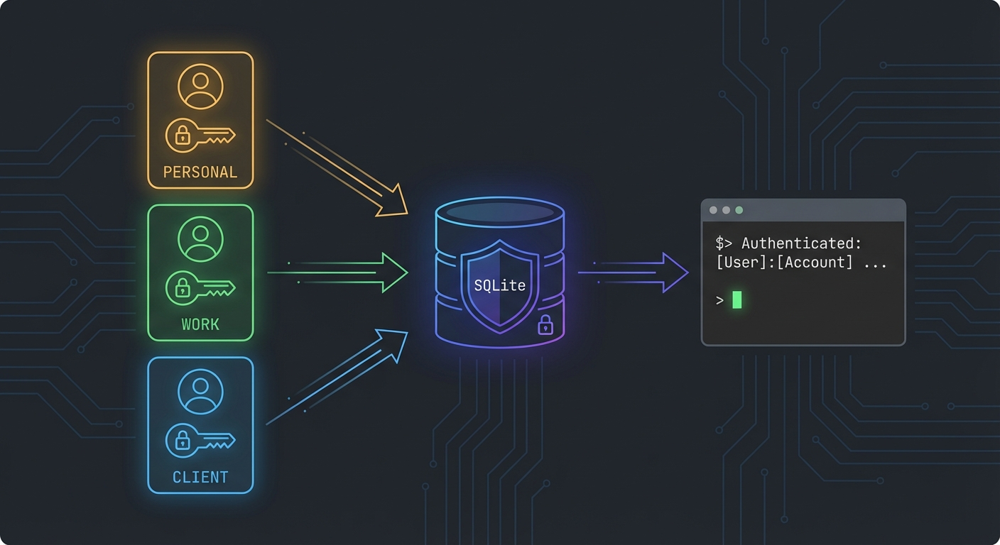
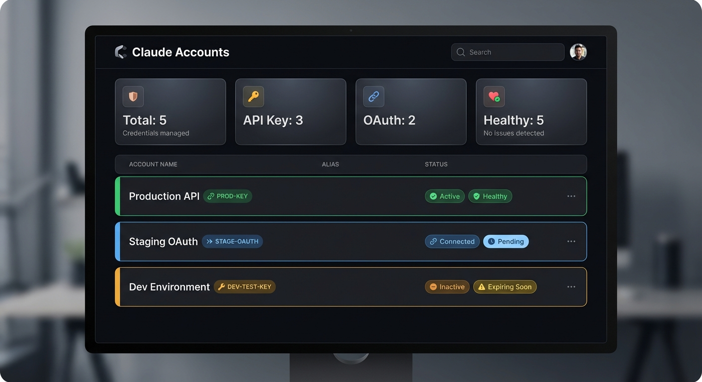

<p align="center">
  
</p>

<h1 align="center">Claude Accounts Manager</h1>

<p align="center">
  <strong>Multiple Claude Code accounts. One shared <code>~/.claude</code>. Zero duplication.</strong>
</p>

<p align="center">
  
  
  
  
</p>

---

## The Problem

Using Claude Code with multiple accounts means duplicating your entire `~/.claude` directory. Each copy needs its own config, plugins, MCP servers, and skills. Update one? Update them all.

## The Solution

Claude Accounts Manager stores all your credentials encrypted in a single SQLite database. When you launch Claude, the right credential is decrypted and injected as an environment variable. One `~/.claude` directory, shared by all accounts.

```
Before:                              After:
~/.claude-perso/                     ~/.claude/              (one, shared)
~/.claude-boulot/                    ~/.claude-accounts/
~/.claude-client/                      accounts.db           (encrypted)
  duplicated config everywhere         .key                  (Fernet key)
  plugins reinstalled 3x
                                     claude-perso   injects ANTHROPIC_API_KEY
                                     claude-boulot  injects CLAUDE_CODE_OAUTH_TOKEN
                                       same config, same plugins, same skills
```

<p align="center">
  
</p>

## Features

- **Encrypted storage** -- Fernet AES-128 encryption, `chmod 600` on database and key files
- **API Key + OAuth** -- Supports both `ANTHROPIC_API_KEY` and `CLAUDE_CODE_OAUTH_TOKEN`
- **OAuth capture** -- Run `claude auth login`, then capture tokens from `.credentials.json`
- **Shell aliases** -- Auto-generated `claude-perso`, `claude-boulot` aliases
- **Web dashboard** -- Visual management with health monitoring
- **CLI** -- Full-featured command-line interface
- **Export/Import** -- Backup and restore your accounts as JSON
- **Token monitoring** -- Track OAuth expiration, get alerts when tokens need refresh

## Installation

```bash
git clone https://github.com/ronyk/claude-accounts.git
cd claude-accounts
python3 -m venv venv
source venv/bin/activate
pip install -r requirements.txt
```

Requirements: Python 3.10+, `flask`, `cryptography`.

> **Note:** The virtual environment must be activated (`source venv/bin/activate`) each time you open a new terminal before running any `python` command.

## Quick Start

### 1. Add an API Key Account

```bash
python cli.py add perso --key sk-ant-api03-xxxxx
```

### 2. Launch Claude with That Account

```bash
python cli.py launch perso
# Injects ANTHROPIC_API_KEY=sk-ant-api03-xxxxx and runs claude
```

### 3. Add a Second Account and Switch

```bash
python cli.py add boulot --key sk-ant-api03-yyyyy
python cli.py launch boulot    # different terminal, different account
```

That's it. Same `~/.claude`, same config, different credentials.

## Usage

### CLI Commands

| Command | Description |
|---------|-------------|
| `add <name> --key <key>` | Add an API key account |
| `add <name> --oauth` | Add an OAuth account (tokens captured later) |
| `login <name>` | Run OAuth login + capture tokens automatically |
| `launch <name>` | Launch Claude with the account's credentials |
| `list` | List all accounts with status |
| `status <name>` | Check token expiry for an account |
| `aliases` | Print generated shell aliases |
| `install` | Install aliases into `.bashrc` / `.zshrc` |
| `export` | Export all accounts as JSON |
| `import <file>` | Import accounts from JSON file |
| `serve` | Start the web dashboard |

### OAuth Accounts

For Claude Pro/Team/Max accounts that use OAuth instead of API keys:

```bash
# Step 1: Authenticate with Claude (if not already done)
claude
# Auth happens automatically on first launch — complete it, then exit

# Step 2: Capture the tokens into an account
claude-accounts login client
# Reads tokens from ~/.claude/.credentials.json
# Stores them encrypted in SQLite
# Account is auto-created if it doesn't exist

# Step 3: Use it
claude-accounts launch client
# Injects CLAUDE_CODE_OAUTH_TOKEN and runs claude
```

### Shell Aliases

Generate aliases so you can type `claude-perso` instead of `python cli.py launch perso`:

```bash
# Install aliases into your shell (run once, from the venv)
python cli.py install
source ~/.claude-accounts/aliases.sh

# Now use directly — no venv activation needed:
claude-accounts list       # CLI wrapper auto-uses the venv
claude-accounts add work --key sk-ant-...
claude-perso               # launches with personal API key
claude-boulot              # launches with work OAuth token
claude-client              # launches with client credentials
```

## Web Dashboard

```bash
python cli.py serve --port 5111
# or
python server.py
```

Open http://localhost:5111

<p align="center">
  
</p>

The dashboard provides:

- **Health monitoring** -- See which accounts are active, expired, or need login
- **One-click actions** -- Copy launch commands, capture OAuth tokens
- **Search & filter** -- Find accounts quickly
- **Keyboard shortcuts** -- `N` to add, `/` to search, `Esc` to close

## How It Works

```
                    Credential Flow
                    ===============

  ┌──────────────┐     ┌───────────────┐     ┌──────────────┐
  │  API Key     │     │               │     │              │
  │  sk-ant-...  │────▶│  SQLite DB    │     │  claude      │
  │              │     │  (encrypted)  │────▶│  (env var    │
  ├──────────────┤     │               │     │   injected)  │
  │  OAuth Token │     │  Fernet       │     │              │
  │  sk-ant-oat  │────▶│  AES-128      │     │              │
  └──────────────┘     └───────────────┘     └──────────────┘

  Storage                Encryption            Runtime
  ~/.claude-accounts/    chmod 600             ANTHROPIC_API_KEY=xxx claude
  accounts.db            .key file             CLAUDE_CODE_OAUTH_TOKEN=yyy claude
```

### OAuth Token Capture

When you run `claude-accounts login <name>`:

1. The CLI reads tokens from `~/.claude/.credentials.json` (created when you first run `claude`)
2. Encrypts the tokens and stores them in SQLite
3. On next `launch`, the access token is decrypted and injected as `CLAUDE_CODE_OAUTH_TOKEN`

> **Note:** You must run `claude` at least once to authenticate before capturing tokens. Auth happens automatically on first launch.

## Security

| Measure | Details |
|---------|---------|
| **Encryption** | Fernet AES-128 (symmetric, authenticated) |
| **Key storage** | `~/.claude-accounts/.key`, `chmod 600` |
| **Database** | `~/.claude-accounts/accounts.db`, `chmod 600` |
| **API response** | Credentials are masked in list endpoints |
| **Export** | `/api/export` returns decrypted data -- handle with care |
| **Aliases** | Contain credentials in plaintext (same security as `.bashrc` env vars) |

Credentials are never stored in plaintext on disk except in Claude's own `.credentials.json` (which the CLI reads from, not writes to).

## API Endpoints

| Method | Route | Description |
|--------|-------|-------------|
| `GET` | `/api/accounts` | List accounts (credentials masked) |
| `POST` | `/api/accounts` | Add an account |
| `PUT` | `/api/accounts/:id` | Update an account |
| `DELETE` | `/api/accounts/:id` | Delete an account |
| `GET` | `/api/accounts/:id/status` | Token status (valid, expired, needs login) |
| `POST` | `/api/accounts/:id/capture-oauth` | Capture tokens from `.credentials.json` |
| `POST` | `/api/accounts/:id/launch` | Get launch command with env vars |
| `GET` | `/api/generate-aliases` | Generated aliases script |
| `POST` | `/api/install-aliases` | Install aliases into shell |
| `GET` | `/api/export` | Export all accounts (decrypted) |
| `POST` | `/api/import` | Import accounts from JSON array |

## Project Structure

```
claude-accounts/
  cli.py          CLI interface
  server.py       Flask API + serves dashboard
  db.py           Database layer (SQLite + encryption)
  index.html      Web dashboard (single-file SPA)
  requirements.txt
  assets/         README illustrations
```

## Contributing

Contributions are welcome. The codebase is intentionally simple -- three Python files and one HTML file.

To set up for development:

```bash
git clone <repo-url>
cd claude-accounts
python3 -m venv venv
source venv/bin/activate
pip install -r requirements.txt
python server.py
```

## License

MIT
